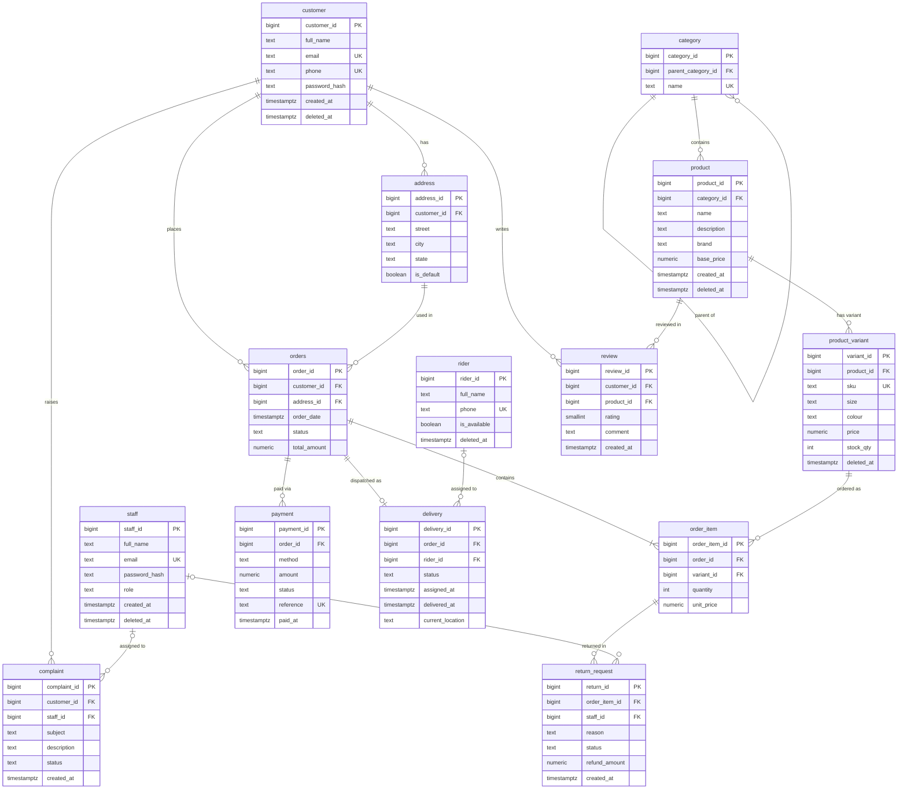

# ThreadHaus ER Diagram

```mermaid
erDiagram

    customer {
        bigint customer_id PK
        text full_name
        text email UK
        text phone UK
        text password_hash
        timestamptz created_at
        timestamptz deleted_at
    }

    address {
        bigint address_id PK
        bigint customer_id FK
        text street
        text city
        text state
        boolean is_default
    }

    staff {
        bigint staff_id PK
        text full_name
        text email UK
        text password_hash
        text role
        timestamptz created_at
        timestamptz deleted_at
    }

    rider {
        bigint rider_id PK
        text full_name
        text phone UK
        boolean is_available
        timestamptz deleted_at
    }

    category {
        bigint category_id PK
        bigint parent_category_id FK
        text name UK
    }

    product {
        bigint product_id PK
        bigint category_id FK
        text name
        text description
        text brand
        numeric base_price
        timestamptz created_at
        timestamptz deleted_at
    }

    product_variant {
        bigint variant_id PK
        bigint product_id FK
        text sku UK
        text size
        text colour
        numeric price
        int stock_qty
        timestamptz deleted_at
    }

    orders {
        bigint order_id PK
        bigint customer_id FK
        bigint address_id FK
        timestamptz order_date
        text status
        numeric total_amount
    }

    order_item {
        bigint order_item_id PK
        bigint order_id FK
        bigint variant_id FK
        int quantity
        numeric unit_price
    }

    payment {
        bigint payment_id PK
        bigint order_id FK
        text method
        numeric amount
        text status
        text reference UK
        timestamptz paid_at
    }

    delivery {
        bigint delivery_id PK
        bigint order_id FK
        bigint rider_id FK
        text status
        timestamptz assigned_at
        timestamptz delivered_at
        text current_location
    }

    return_request {
        bigint return_id PK
        bigint order_item_id FK
        bigint staff_id FK
        text reason
        text status
        numeric refund_amount
        timestamptz created_at
    }

    complaint {
        bigint complaint_id PK
        bigint customer_id FK
        bigint staff_id FK
        text subject
        text description
        text status
        timestamptz created_at
    }

    review {
        bigint review_id PK
        bigint customer_id FK
        bigint product_id FK
        smallint rating
        text comment
        timestamptz created_at
    }

    %% Relationships

    customer ||--o{ address : "has"
    customer ||--o{ orders : "places"
    address ||--o{ orders : "used in"
    customer ||--o{ complaint : "raises"
    customer ||--o{ review : "writes"
    category ||--o{ category : "parent of"
    category ||--o{ product : "contains"
    product ||--o{ product_variant : "has variant"
    product ||--o{ review : "reviewed in"
    orders ||--|{ order_item : "contains"
    product_variant ||--o{ order_item : "ordered as"
    orders ||--o{ payment : "paid via"
    orders ||--o| delivery : "dispatched as"
    rider |o--o{ delivery : "assigned to"
    order_item ||--o{ return_request : "returned in"
    staff |o--o{ return_request : "handles"
    staff |o--o{ complaint : "assigned to"
```
